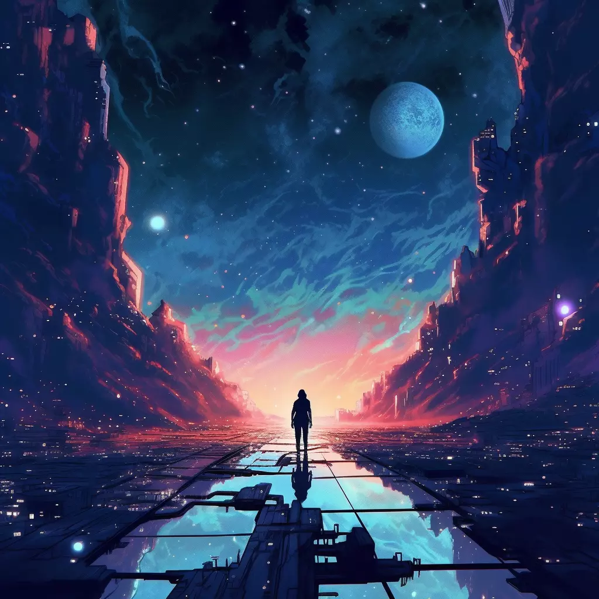

<!-- prettier-ignore-start -->
<!-- markdownlint-disable -->
<div align="center" style="margin-top:50px">
  
</div>
<!-- markdownlint-restore -->
<!-- prettier-ignore-end -->

# Starknet Quest Client

Leading quests platform on Starknet to onboard your next million users. We provide a platform for users to discover new apps and for companies to pitch your products and new features to users and get user feedback.

[](https://github.com/starknet-id/starknet.quest/issues?q=is:issue+is:open+label:%22open+for+contribution%22)

## About

Starknet Quest helps protocols attract and retain users by creating gamified quest experiences on Starknet.

## How it works

### Some things to help you get familiar with the codebase

#### Quests

* A Quest is a set of tasks which a user can do. On completing a quest they are eligible to get an NFT as proof of completion and possible tokens as a reward.
* Each Quest is created by one of the leading Dapps on starknet and are reviewed by the maintainers on the repo before publishing on the application.

#### Achievements

* An achievement are another type of tasks which are milestone based and long term.
* Each Achievement has certain milestones within them and on completing them they get rewarded with a building on the **Starknet Quest Land** (explained below)

#### Land

* Your land is the visual representation of your on-chain reputation which grows in size as you complete more quests and achievements on the platform.
* You can visit this to check your overall progress on the starknet quest platfrom and expand it by completing any new quests or achievements.


## How to get started

Clone the repository
```bash
git clone https://github.com/starknet-id/starknet.quest.git
```


Install dependencies and run the development build

```bash
npm i
npm run dev
```

You should see something like this:

```sh
> starknet-id-website@0.1.0 dev
> next dev

   ▲ Next.js 14.1.0
   - Local:        http://localhost:3000
   - Environments: .env

 ✓ Ready in 1431ms
```

## 🤝 Contribute

We're always looking for passionate developers to join our community and contribute to Starknet Quest. Check out our [contributing guide](./docs/CONTRIBUTING.md)
for more information on how to get started.
## Contributors

<!-- ALL-CONTRIBUTORS-LIST:START - Do not remove or modify this section -->
<!-- prettier-ignore-start -->
<!-- markdownlint-disable -->

<!-- markdownlint-restore -->
<!-- prettier-ignore-end -->

<!-- ALL-CONTRIBUTORS-LIST:END -->

